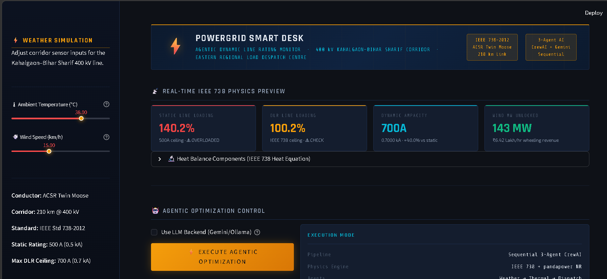
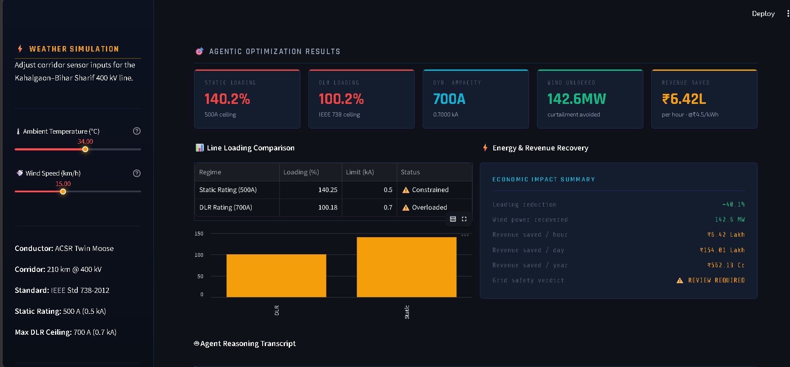
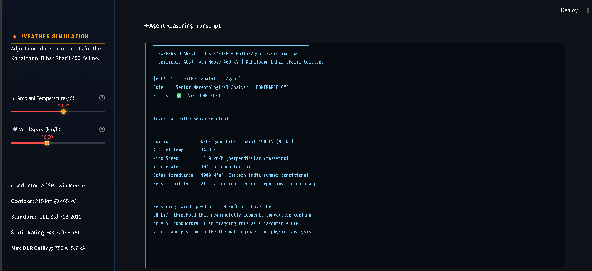

# ⚡ AI-Driven Dynamic Line Rating for Smart Grid Congestion Management


An AI-driven decision support system that integrates **IEEE Std 738 thermal modeling**, **CrewAI multi-agent orchestration**, **Pandapower power-flow simulation**, and **Streamlit** to demonstrate **Dynamic Line Rating (DLR)** for intelligent transmission line congestion management and renewable energy integration.

---

# 📖 Overview

Conventional transmission networks typically operate using **static thermal ratings**, where transmission limits remain fixed regardless of changing weather conditions. This conservative approach often results in underutilized transmission infrastructure, renewable energy curtailment, and reduced operational flexibility.

This project demonstrates an **AI-assisted Dynamic Line Rating (DLR)** framework that estimates safe transmission capacity using real-time weather parameters such as ambient temperature and wind speed.

The prototype combines:

- IEEE Std 738 conductor thermal modeling
- CrewAI multi-agent orchestration
- Pandapower digital twin simulation
- Interactive Streamlit dashboard

to simulate an intelligent operator decision-support system capable of evaluating transmission line capacity under varying environmental conditions.

---

# 🚀 Features

- IEEE Std 738 based Dynamic Line Rating implementation
- Physics-based conductor thermal modeling
- CrewAI multi-agent workflow
- Pandapower digital twin simulation
- Interactive weather simulation
- Dynamic conductor ampacity estimation
- Grid loading comparison
- Renewable energy recovery estimation
- Revenue impact estimation
- Interactive Streamlit dashboard
- Offline simulation mode
- Optional cloud LLM backend using Google Gemini

---

# 🏗️ System Architecture

```text
                Weather Inputs
                      │
                      ▼
          Weather Analytics Agent
                      │
                      ▼
        IEEE 738 Thermal Physics Engine
                      │
                      ▼
        Dynamic Ampacity Calculation
                      │
                      ▼
      Pandapower Grid Simulation
                      │
                      ▼
          Grid Dispatcher Agent
                      │
                      ▼
         Streamlit Operator Dashboard
```

---

# ⚙️ Technology Stack

| Category | Technologies |
|-----------|--------------|
| Programming Language | Python |
| AI Framework | CrewAI |
| LLM (Optional) | Google Gemini |
| Power System Simulation | Pandapower |
| User Interface | Streamlit |
| Scientific Computing | NumPy, Pandas |
| Thermal Standard | IEEE Std 738-2012 |

---

# 📂 Project Structure

```text
powergrid-agentic-dlr
│
├── app.py
├── agents_config.py
├── physics_dlr.py
├── grid_engine.py
├── requirements.txt
├── README.md
├── LICENSE
└── screenshots
```

---

# 🔄 Workflow

```text
Weather Conditions
        │
        ▼
Weather Analytics Agent
        │
        ▼
IEEE 738 Thermal Analysis
        │
        ▼
Dynamic Ampacity Calculation
        │
        ▼
Pandapower Load Flow
        │
        ▼
Grid Dispatcher Agent
        │
        ▼
Operator Dashboard
```

---

# 📊 Dashboard Preview

## Main Dashboard



---

## Optimization Results



---

## Agent Reasoning Transcript



---

# ▶️ Installation

Clone the repository

```bash
git clone https://github.com/YOUR_GITHUB_USERNAME/powergrid-agentic-dlr.git
```

Move into the project directory

```bash
cd powergrid-agentic-dlr
```

Install dependencies

```bash
pip install -r requirements.txt
```

Launch the application

```bash
streamlit run app.py
```

---

# 🧪 Running the Application

1. Launch the Streamlit dashboard.
2. Configure ambient temperature and wind speed.
3. Preview IEEE 738 thermal calculations.
4. Execute the optimization workflow.
5. Compare static and dynamic transmission ratings.
6. Analyze recovered transmission capacity and estimated renewable energy utilization.

---

# 🤖 LLM Backend

The application supports two execution modes.

### Offline Simulation (Default)

- No API key required.
- Demonstrates the complete Dynamic Line Rating workflow using deterministic calculations.
- Recommended for demonstrations, testing, and evaluation.

### Cloud LLM Mode (Optional)

To enable CrewAI reasoning with Google Gemini:

1. Obtain a Google AI Studio API key.
2. Configure the environment variable:

```bash
GOOGLE_API_KEY=YOUR_API_KEY
```

3. Enable **Use LLM Backend** from the dashboard.

If no API key is configured, the application can still be fully evaluated using Offline Simulation Mode.

---

# 📈 Example Capabilities

- Simulates real-time transmission line operating conditions.
- Calculates safe conductor ampacity using IEEE Std 738.
- Performs Newton-Raphson power-flow analysis.
- Estimates renewable energy recovery through Dynamic Line Rating.
- Compares static and dynamic transmission ratings.
- Demonstrates AI-assisted operational decision support.

---

# 🚧 Future Improvements

- Live weather API integration
- SCADA connectivity
- PMU data integration
- Multi-line transmission optimization
- Historical analytics dashboard
- Reinforcement Learning-based dispatch optimization
- Automatic congestion prediction

---

# ⚠️ Disclaimer

This repository is an **academic prototype** developed for learning, research, and demonstration purposes.

It is inspired by real-world Dynamic Line Rating concepts used in modern power systems but is **not intended for production deployment or operational grid control**.

---

# 👩‍💻 Author

**Sunidhi Priya**

B.Tech Computer Science and Engineering (Data Science)

Vellore Institute of Technology, Vellore

**LinkedIn**

https://www.linkedin.com/in/sunidhi-priya-4b84a124a/

**GitHub**

https://github.com/SunidhiPria

---

# 📜 License

This project is licensed under the MIT License.